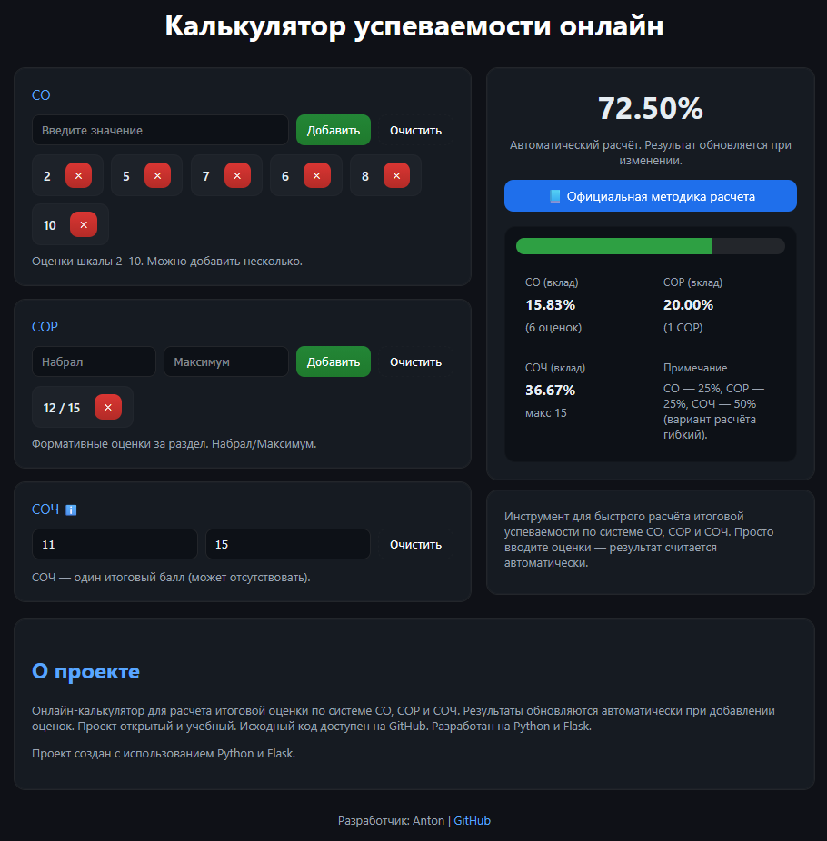

# 📊 BilimCalc — Калькулятор СО, СОР и СОЧ

<p align="center">
  Онлайн-калькулятор для расчёта итоговой оценки по системе СО, СОР и СОЧ (Казахстан)
</p>

<p align="center">
  
  
  
  
  
  
  
</p>

---

## 🌐 Live Demo

👉 https://bilimcalc.vercel.app

---

## 📸 Интерфейс



---

## 🚀 Возможности

- 📊 Расчёт СО (формативные оценки)
- 🧮 Расчёт СОР (суммативные за раздел)
- 🎯 Расчёт СОЧ (итоговая работа)
- 🤖 График динамики с ML-анализом
- ⚡ Автоматический пересчёт в реальном времени
- 🎨 Динамическая цветовая индикация результата
- 📱 Адаптивный интерфейс
- 🔍 SEO-оптимизация

---

## 🧠 Как работает расчёт

Итоговая оценка рассчитывается на основе:

- СО
- СОР
- СОЧ

Дополнительно строится график динамики СО и применяется линейная регрессия для отображения тренда.

---

## 🛠 Технологический стек

### Backend
- Python 3
- Flask
- Gunicorn

### Frontend
- HTML5
- CSS3
- Vanilla JavaScript
- Chart.js

### Deploy
- Vercel

---

## 📦 Установка локально

```bash
git clone https://github.com/antonbogdan165/grade-calculator.git
cd grade-calculator
pip install -r requirements.txt
python app.py
```

После запуска открой в браузере:

```
http://127.0.0.1:5000
```

---

## 📈 SEO-оптимизация

Проект включает:

- sitemap.xml
- robots.txt
- meta-description
- semantic HTML

---

## 🎯 Цель проекта

Создать удобный инструмент для учеников школ Казахстана, позволяющий быстро рассчитывать итоговую оценку и контролировать успеваемость.

---

## 📜 Лицензия

© 2026 Anton Bogdan

Данный проект разрешается использовать, копировать и изменять
исключительно в некоммерческих целях.

Коммерческое использование, перепродажа, размещение с рекламой
или иная форма извлечения прибыли без письменного разрешения
правообладателя запрещены.

